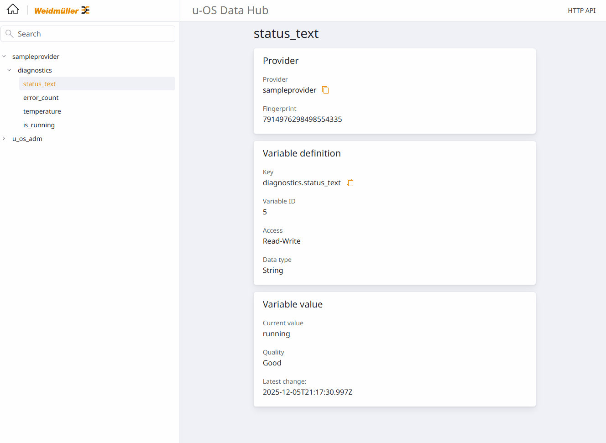

# Minimal Samples für den u-OS Data Hub

Dieses Repository bündelt mehrere Python-Beispiele rund um NATS ↔ Data-Hub-Kommunikation. Im Fokus stehen:

- **Provider** – stellen Variablen bereit (z. B. `provider.py`, `provider_cli.py`, `samples/...`).
- **Consumer** – lesen oder schreiben Werte (`consumer.py`, `provider_consumer.py`, `list_providers.py`).
- **Hilfspakete** – unter `src/` liegen FlatBuffers-Bindings und Helpers wie NATS-Client, Payload-Builder, Simulationen.

Die Skripte lassen sich sowohl auf einem Entwicklungsrechner als auch direkt auf einem u-OS-Gerät ausführen. Wenn du sie **auf der Steuerung** startest, kannst du `HOST = "127.0.0.1"` verwenden – dann läuft alles lokal, ohne dass ein externer PC benötigt wird.

## 1. Vorbereitungen auf der Steuerung

1. **OAuth-Clients anlegen**: Im u-OS Control Center (Screenshot siehe `docs/control-center-clients.png`) zu *Identity & access → Clients* wechseln und oben rechts auf **Add client** drücken.
   - **Provider** `sampleprovider`: Access `hub.variables` → Rolle **Provide**
   - **Consumer** `sampleconsumer`: Access `hub.variables` → Rolle **ReadWrite** (oder Read)
   - Die zugehörigen Client ID & Secrets notieren.


2. **Token-Test**:
   ```bash
   curl -vk -u '<CLIENT_ID>:<CLIENT_SECRET>' \
        -d 'grant_type=client_credentials&scope=hub.variables.provide' \
        https://<IP-ODER-HOST>/oauth2/token
   ```
   Erfolgreich ist der Test, wenn ein `access_token` zurückkommt. Für den Consumer analog mit `scope=hub.variables.readwrite` testen.

## 2. Projekt lokal vorbereiten / Verzeichnisüberblick

```
nats-python/
├── provider*.py, consumer*.py  # Einstiegsskripte (Provider, Consumer, Kombis)
├── samples/                    # Weitere Szenarien (z. B. CLI-Provider)
├── src/                        # Gemeinsame Bibliotheken (Auth, NATS, Payloads, FlatBuffers)
├── requirements.txt            # Alle Python-Abhängigkeiten
└── README.md                   # Diese Anleitung
```

**Setup**

```bash
git clone https://github.com/uiff/nats-python-uc20.git
cd nats-python-uc20
python3 -m venv .venv
source .venv/bin/activate
pip install --upgrade pip
pip install -r requirements.txt
```

> `.venv` bleibt im Projektordner und kapselt alles. Vor jedem Start `source .venv/bin/activate`.
>
> Auf der u-OS-Steuerung funktioniert dasselbe: Repository auf das Gerät klonen, im Ordner `nats-python-uc20` arbeiten und wie oben `.venv` anlegen – danach kannst du Provider/Consumer lokal laufen lassen (Host = `127.0.0.1`).

## 3. Konfiguration anpassen

Alle zentralen Angaben liegen **nur** in `src/iotueli_sample/config.py`. Das gilt für alle Skripte im Repo – Änderungen dort wirken sich auf Provider, Consumer und Samples gleichzeitig aus.

| Feld                | Bedeutung                                                                 |
|---------------------|----------------------------------------------------------------------------|
| `HOST` / `PORT`     | IP-Adresse/Port deiner Steuerung. Auf dem Gerät selbst: `127.0.0.1` / `49360`. |
| `PROVIDER_ID`       | Anzeigename des Providers im Data Hub                                     |
| `CLIENT_NAME`       | Frei wählbarer Client-Name (sollte zum Provider passen)                    |
| `CLIENT_ID/SECRET`  | Werte aus dem Control Center → Clients                                    |
| `VARIABLE_DEFINITIONS` | Liste der Variablen, die im Data Hub erscheinen sollen                  |

> Nach jeder Änderung in `config.py` Provider/Consumer neu starten.

## 4. Provider starten (z. B. `provider.py`)

1. `.venv` aktivieren: `source .venv/bin/activate`
2. Provider starten:
   ```bash
   python3 provider.py
   ```
3. Die Konsole zeigt, ob Registrierung & Events funktionieren (`NATS-Verbindung steht`, `Registry-Status ...`). Sobald `OK`, taucht der Provider im Data Hub auf.  
   Alternative Varianten:
   - `provider_cli.py` → interaktives CLI mit manuellen Updates.
   - `samples/provider_minimal.py` → stark vereinfachter Einstiegscode für eigene Projekte.



## 5. Consumer starten (optional)

1. `.venv` aktivieren (falls nicht schon geschehen).
2. Skript auswählen:
   - `consumer.py` → reine Snapshot-/Event-Ausgabe.
   - `provider_consumer.py` → Provider + Consumer im selben Prozess (hilfreich für Tests).
   - `list_providers.py` → nutzt Registry-Query, um verfügbare Provider aufzulisten.
3. Ausführen:
   ```bash
   python3 consumer.py
   ```
4. Die Ausgabe zeigt zunächst alle aktuellen Werte und anschließend jede Änderung. Auf einem u-OS-Gerät kannst du so direkt prüfen, ob die Variablen im Data Hub ankommen oder eine (lokale) Consumer-Anwendung schreiben.

### Bestehenden Provider (z. B. `u_os_adm`) lesen

1. Führe `python3 list_providers.py` aus, um dir alle Provider anzuzeigen, die die Registry aktuell kennt.
2. Setze in `src/iotueli_sample/config.py` die Felder `PROVIDER_ID` und `CLIENT_NAME` auf den gewünschten Provider (z. B. `u_os_adm`).  
   > Wichtig: Der OAuth-Client muss Leserechte (`hub.variables.readonly` oder `hub.variables.readwrite`) besitzen – bei System-Providern genügt es, wenn dein eigener Client diese Rollen hat.
3. Starte anschließend `python3 consumer.py`. Das Skript fragt über `v1.loc.<PROVIDER_ID>.vars.qry.read` die Variablen ab und lauscht auf deren Events. Die Simulation läuft nur für `sampleprovider`; für echte Provider steuerst du den Wertfluss direkt auf der Steuerung.

## 6. Troubleshooting

- **401 `invalid_client`** – Client-ID/Secret oder Scope stimmt nicht. Token-Test überprüfen.
- **`permissions violation`** – Dem OAuth-Client fehlt die Rolle `Provide` bzw. `Read/ReadWrite`. Im Control Center korrigieren und Skript neu starten.
- **`no responders`** – Provider läuft nicht oder Provider-ID im Consumer stimmt nicht. Provider neu starten und sicherstellen, dass beide die gleiche `PROVIDER_ID` verwenden.
- **`No module named 'weidmueller'`** – Skripte nur aus dem Ordner `nats-python` mit aktivierter `.venv` starten; dort wird das `src/`-Verzeichnis automatisch auf den `PYTHONPATH` gesetzt.
- **Self-signed TLS** – Die Skripte deaktivieren die Zertifikatsprüfung (`verify=False`). Für produktive Umgebungen sollte ein echtes Zertifikat hinterlegt werden.

## 7. Docker-Build (optional)

Für schnelle Tests kannst du einen Container bauen. Stelle vorher sicher, dass `src/iotueli_sample/config.py` die richtigen Verbindungsdaten enthält.

```bash
cd ~/App/nats-python
docker build -t nats-python-sample .
# Provider im Host-Netz starten (damit der Container den NATS-Port erreicht):
docker run --rm -it --network host nats-python-sample
```

- Der Container startet standardmäßig `python provider.py`. Du kannst einen anderen Befehl übergeben:
  ```bash
  docker run --rm -it --network host nats-python-sample python consumer.py
  ```
- Beim Einsatz direkt auf der Steuerung empfiehlt es sich, `HOST = "127.0.0.1"` zu setzen und ebenfalls `--network host` zu verwenden.

Viel Erfolg! Änderungen an Konfiguration oder Variablen einfach in den jeweiligen Dateien anpassen und den Provider neu starten.
